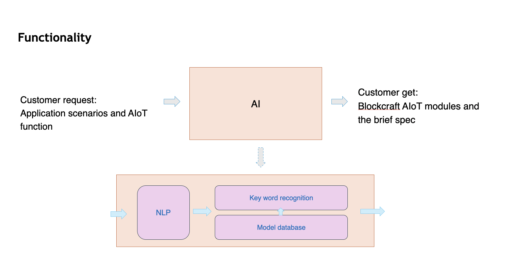
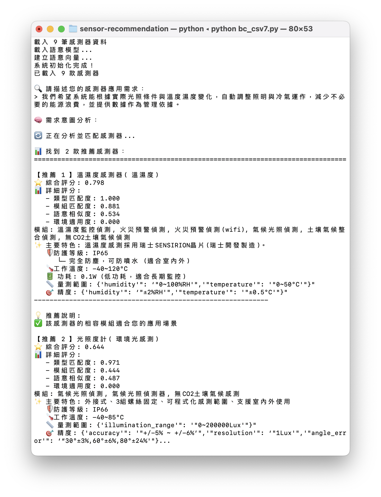
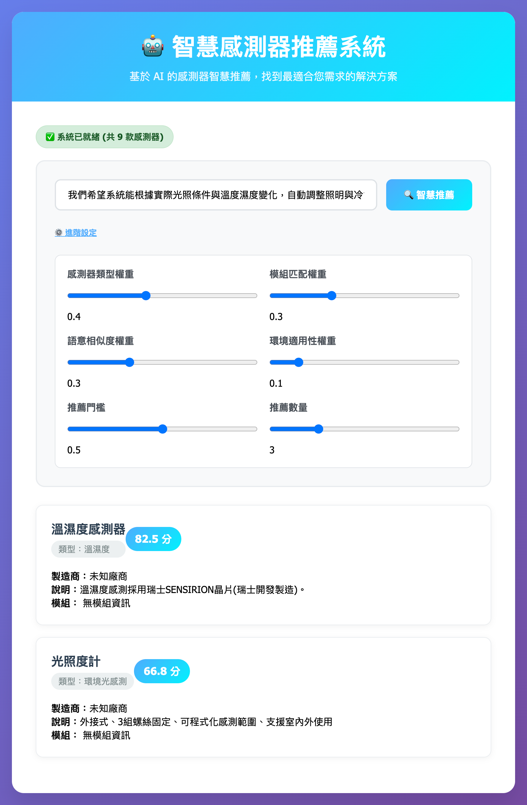
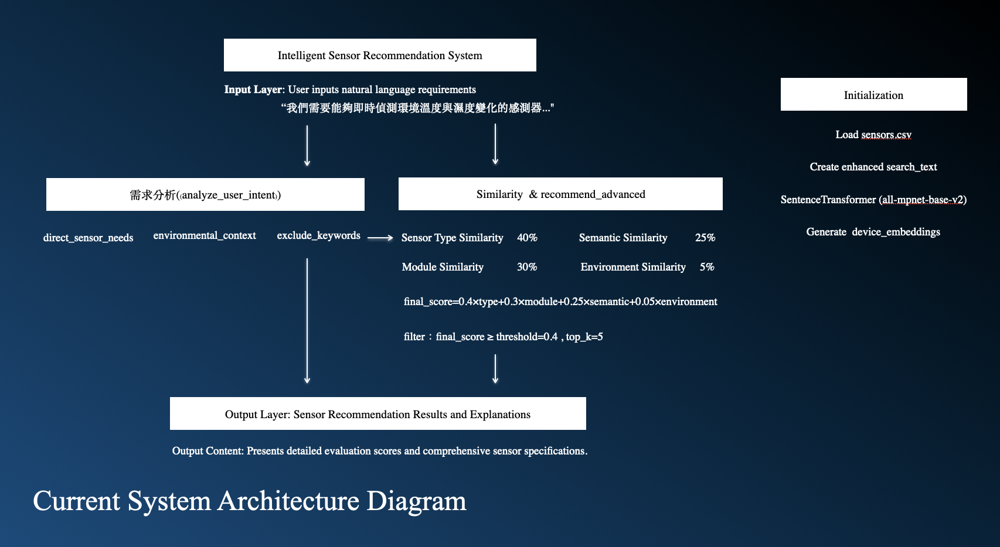

# 感測器推薦系統 (Sensor Recommendation System)

## 專案簡介
此專案為我在感測器公司實習期間，獨立負責完成的專案。  
系統能根據用戶輸入的需求，結合感測器產品資料，輸出前 K 筆最符合需求的感測器推薦。

## 系統使用流程

## 系統架構
1. **資料處理**：將感測器產品資料 (CSV) 轉為語意向量
2. **多面向評分**：
   - 類型 (Type)
   - 適用場景模組 (Module)
   - 語意理解 (NLU)
   - 環境適用性 (Environment)
3. **推薦輸出**：依加權分數排序，提供前 K 筆推薦

## 技術細節
- **語意模型**：Sentence-BERT
- **程式語言**：Python
- **前端展示**：簡易 HTML (index.html)
- **資料來源**：感測器產品資料 (CSV)

## 專案結構
sensor-recommendation/
│── README.md # 專案說明
│── src/ # 程式碼
│ ├── main.py # API 呼叫
│ ├── index.html # 範例網頁
│ ├── bc_csv7.py # 推薦邏輯
│ ├── model_saving.py # 模型存取
│── data/
│ ├── sensors.csv # 感測器資料 (假資料示範)
│── model/ # 模型檔 (未上傳, 附下載連結)
│── docs/
│ ├── demo.png # 系統運行截圖
│ └── flowchart.png # 系統流程圖

## 成果展示
Demo on terminal

Demo on web

## 收穫
- 獨立完成一個從需求定義到系統實作的專案  
- 強化 NLP 與推薦系統的實作能力  
- 理解如何將研究方法落實於實務場景  

## 系統流程圖

